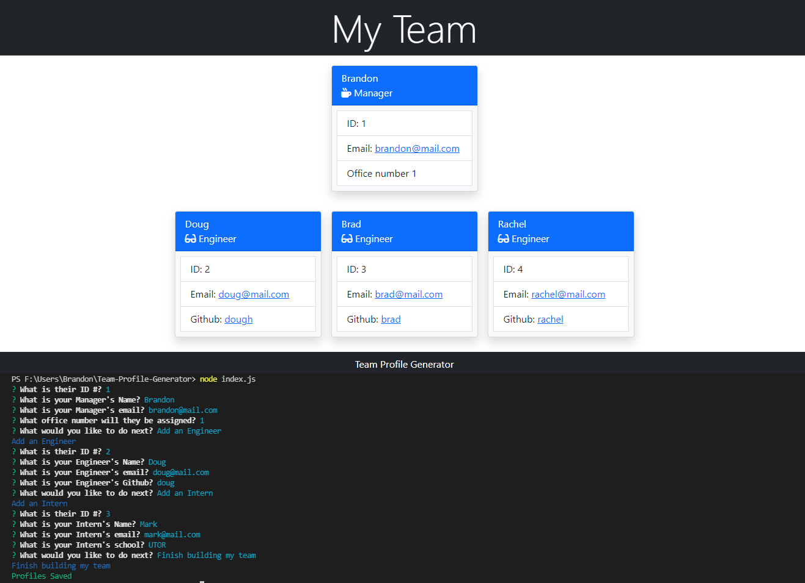

  # Team profile Generator

  
  
  ## Description
  A quick application to generate team profiles; Manager, Engineer, Employee and, Intern.

  ## Table of Contents 
  
  - [Installation](#installation)
  - [Usage](#usage)
  - [License](#license)
  - [Questions](#questions)
  
  ## Installation
  - To install, click the green code button. Download the zip file and unpack. Open in your favourite code editor.
  - Open index.js and open the terminal
  - In the terminal run "npm i"
  - In the termianl run "node index.js"
  - Follow the prompts shown on screen

  ## Usage
  [Watch Usage Video](https://drive.google.com/file/d/1QuX3rTZIm05NjkIhxwyJ4kL_UuTgNDA2/view).

  
  
  
  ## License
  [APACHE](https://www.apache.org/licenses/LICENSE-2.0.txt)
  
  ## Questions
  
  [GitHub Profile](https://github.com/bdubz93).
  
  Questions? You can email me at brandonwinkler@live.ca.
  